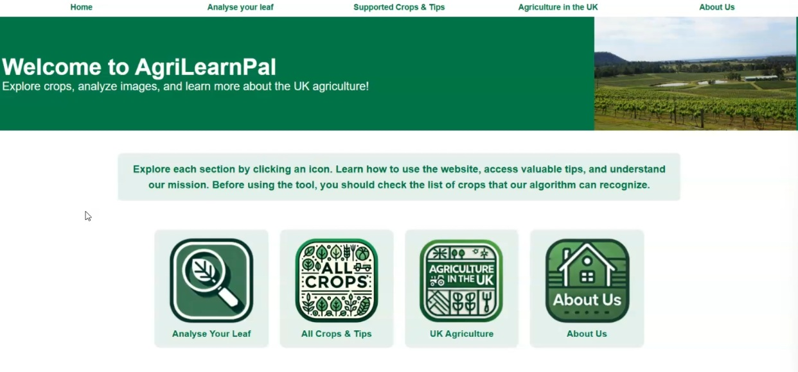
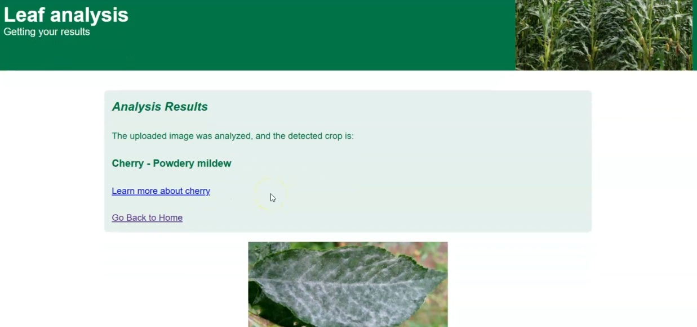
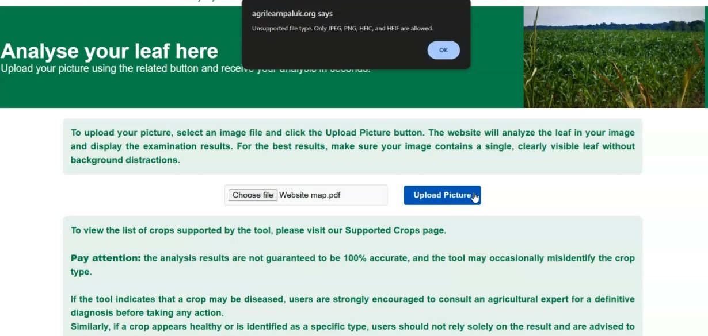

# AgriLearn: Enhancing UK Agricultural Education

## Overview

AgriLearn is a web application designed to address the gap in interactive, technology-driven tools for agricultural education in the UK. It specifically focuses on enhancing students' understanding of crop recognition and health management. The platform allows users to upload images of crop leaves and receive an analysis of their health status, alongside relevant cultivation advice tailored to the UK context, all through an accessible and engaging digital interface.

## Technology Stack

The AgriLearn platform is built with a modern technology stack to ensure robust performance and a good user experience:

* **Machine Learning Model**:
    * Core Model: MobileNetV3-based architecture, fine-tuned for crop leaf classification.
    * Framework: Developed using TensorFlow and Keras.
* **Backend**:
    * Runtime/Framework: Node.js with Express.js for handling API requests and core application logic.
    * ML Model Serving: A Python-based Flask microframework to serve the image classification model.
* **Frontend**:
    * Templating: Handlebars.js for dynamic page rendering.
    * Structure & Styling: HTML, CSS, and Bootstrap for a responsive and user-friendly interface.
* **Deployment & Infrastructure**:
    * Cloud Platform: Hosted on AWS EC2.
    * Web Server/Proxy: Nginx configured as a reverse proxy.
    * Domain & Security: Cloudflare for DNS management, HTTPS/SSL/TLS encryption, and Web Application Firewall (WAF) services.
* **Database Approach**:
    * The primary dataset for model training consisted of over 29,000 images, covering 10 UK-growable crops and 24 distinct healthy/diseased classes. (Note: The live application itself primarily focuses on model inference rather than persistent user data storage beyond temporary image handling).

## Key Features

* **Crop Health Analysis**: Users can upload images of crop leaves, and the ML model classifies them into one of 24 categories, indicating the crop type and its health status (healthy or specific disease).
* **Immediate Feedback**: The system provides instant classification results upon image submission.
* **UK-Specific Cultivation Advice**: Alongside the analysis, users can access cultivation tips and information relevant to agricultural practices in the United Kingdom.
* **Responsive Design**: The user interface is designed to be accessible and usable across various devices, including desktops and mobile browsers.
* **Privacy-Focused**: User-uploaded images are discarded immediately after the analysis is complete.

## Security Highlights

Security and user privacy were key considerations in the development of AgriLearn:

* **HTTPS Encryption**: Secure communication is enforced sitewide using SSL/TLS encryption managed by Cloudflare, protecting data in transit.
* **Image Privacy**: Uploaded images are processed for analysis and then promptly deleted from the server, ensuring user-uploaded content is not stored long-term.
* **File Upload Validation**: The system implements restrictions on file types (e.g., JPEG, PNG) and sizes for uploads, both on the client-side and server-side, to prevent malicious or inappropriate file submissions.
* **Web Application Firewall (WAF)**: Cloudflare’s WAF provides a layer of protection against common web vulnerabilities.
* **Infrastructure Security**: AWS Security Groups are configured with restrictive inbound traffic rules to minimize the server's exposure.
